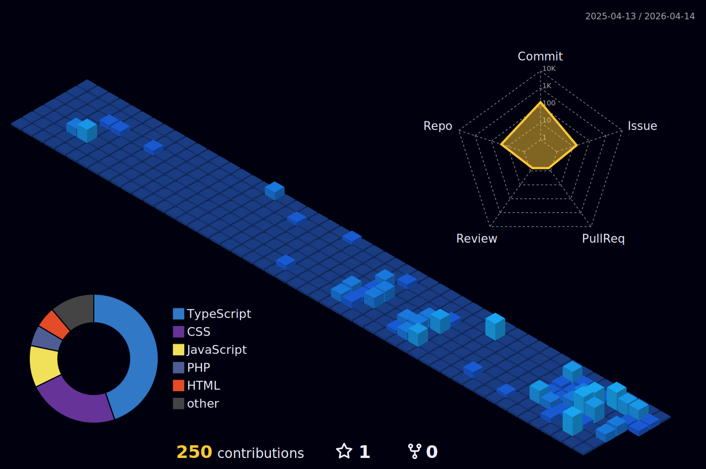

 

  
<a href="https://www.instagram.com/biel_pujol/" target="_blank">

 

<h1 align="center" style="color: #1E90FF; margin-bottom: 20px;">Hi 👋, I'm Leticia</h1>
<h3 align="center" style="color: #1E90FF; margin-bottom: 30px;">A FullStack developer from Brazil</h3>

 
   

  

 
  

---

### 📚 About Me:

  - 🎓 Graduated with a Technical Degree in   Systems Analysis and Development. 
  - 💻 Currently studying for a degree in Systems Analysis and Development. 
  - 🤝 I am looking for help to improve my skills in Systems Analysis and Development. 
  - 📫 How to contact me: leticia11ldsa07@gmail.com.  
  - ⚡ Fun fact: I enjoy programming in Java.

---

### 🔗 Connect with Me:

  
  

---

### 🛠️ Languages and Tools:

  
  
  
  
  
  
  
  

---

### 📊 GitHub Stats:

  

  

  

